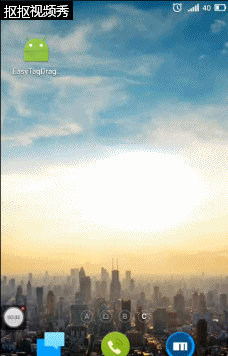

# EasyTagDragView
仿网易新闻app下拉标签选择菜单，长按拖动排序，点击增删标签控件

##示例

##EasyTagDragView的使用

    在layout布局里添加：
    <com.wenhuaijun.easytagdragview.EasyTipDragView
       android:id="@+id/easy_tip_drag_view"
       android:background="@android:color/white"
       android:layout_width="match_parent"
       android:layout_gravity="center"
       android:layout_height="match_parent"/>
       
    在java代码中：
        给EasyTagDragView添加标签数据，包括已添加的标签数据和可添加的标签数据。
        添加的数据bean需实现Tip类，可自由增加成员属。如没特殊需求，可直接使用提供的SimpleTitleTip类
        
        //设置已添加的的标签数据
        easyTipDragView.setDragData(TipDataModel.getDragTips());
        
        //设置可以添加的标签数据
        easyTipDragView.setAddData(TipDataModel.getAddTips());
        
        //在easyTipDragView处于非编辑模式下点击item的回调（编辑模式下点击item作用为删除item）
        easyTipDragView.setSelectedListener(new TipItemView.OnSelectedListener() {
            @Override
            public void onTileSelected(Tip entity, int position, View view) {
                toast(((SimpleTitleTip) entity).getTip());
            }
        });
        
        //设置每次数据改变后的回调（例如每次拖拽排序了标签或者增删了标签都会回调）
        easyTipDragView.setDataResultCallback(new EasyTipDragView.OnDataChangeResultCallback() {
            @Override
            public void onDataChangeResult(ArrayList<Tip> tips) {
                Log.i("heheda", tips.toString());
            }
        });
        
        //设置点击“确定”按钮后最终数据的回调
        easyTipDragView.setOnCompleteCallback(new EasyTipDragView.OnCompleteCallback() {
            @Override
            public void onComplete(ArrayList<Tip> tips) {
                toast("最终数据：" + tips.toString());
            }
        });
        
    注：当已经显示EasyTagDragView的时候，需监听返回键，
        在编辑模式下点击返回键取消编辑模式。非编辑模式下则关闭EasyTagDragView
        
        
        @Override
        public boolean onKeyDown(int keyCode, KeyEvent event) {
            switch (keyCode){
                //点击返回键
                case KeyEvent.KEYCODE_BACK:
                    //判断easyTipDragView是否已经显示出来
                    if(easyTipDragView.isOpen()){
                        if(!easyTipDragView.onKeyBackDown()){
                            btn.setVisibility(View.VISIBLE);
                        }
                        return true;
                    }
                    //....自己的业务逻辑

                    break;
            }
            return super.onKeyDown(keyCode, event);
        }
        

**后期增加更多自定义属性和一些API**
